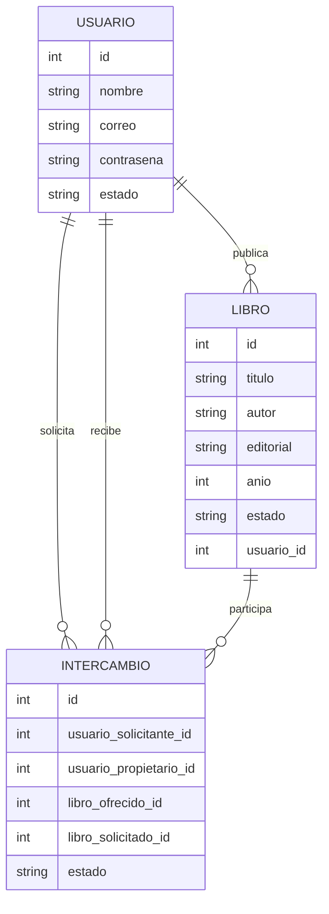
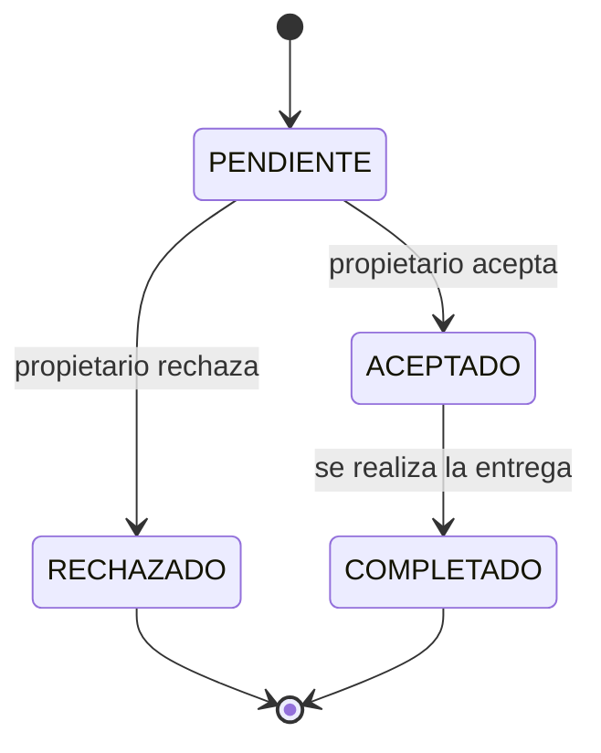

# Hito 1 — Ficha del negocio

## 1. Negocio de referencia

**Clankart** es una plataforma de India creada por Nitesh Garg para que estudiantes puedan publicar y vender libros usados a otros estudiantes.

* **Qué ofrece:** intercambio/compraventa de libros usados entre estudiantes.
* **A quién se dirige:** principalmente a estudiantes.
* **Cómo funciona:** los usuarios publican sus libros y otros estudiantes pueden encontrarlos y contactarlos.
* **Modelo de cobro:** la plataforma comenzó como un servicio gratuito para publicar libros.
* **Cifras declaradas:** el fundador reportó más de 25.000 estudiantes registrados y aproximadamente USD 1.200 de ingresos mensuales al momento de la entrevista.

**Fuente:** caso de Clankart publicado en Starter Story.

## 2. Contraste obligatorio

Como contraste se considera un escenario de una plataforma universitaria de intercambio de libros que no logra mantenerse activa cuando tiene pocos usuarios.

La principal hipótesis es que el problema estaría en la **baja cantidad de usuarios y publicaciones**, porque para que exista un intercambio debe haber suficientes personas ofreciendo y buscando libros al mismo tiempo.

Por esta razón, nuestro proyecto prioriza un proceso sencillo, estados claros y búsqueda de libros disponibles.

## 3. Adaptación al Ecuador

El proyecto se adapta al contexto ecuatoriano considerando:

1. **Pagos:** el intercambio puede realizarse directamente entre usuarios sin pago dentro de la primera versión. Si posteriormente se incorpora compraventa, se podrían agregar medios de pago electrónicos disponibles en Ecuador.
2. **Facturación y tributación:** la primera versión se enfoca en intercambio de libros usados entre usuarios. Si posteriormente se convierte en una actividad comercial, se deberá definir el régimen tributario y la facturación correspondiente según las normas del SRI.
3. **Logística:** se priorizan puntos de encuentro acordados entre los usuarios, especialmente en entornos universitarios.
4. **Poder adquisitivo:** se busca facilitar el acceso a libros usados a estudiantes que desean reducir el costo de adquirir material académico.
5. **Informalidad:** el sistema organiza digitalmente intercambios que normalmente podrían coordinarse mediante redes sociales o grupos informales.

## 4. Modelo preliminar

### 4.1 Entidades

**Usuario**

* id
* nombre
* correo
* contraseña
* estado

**Libro**

* id
* titulo
* autor
* editorial
* anio
* estado
* usuario_id

**Intercambio**

* id
* usuario_solicitante_id
* usuario_propietario_id
* libro_ofrecido_id
* libro_solicitado_id
* estado

### 4.2 Proceso del negocio

1. El usuario se registra en la plataforma.
2. El usuario publica un libro usado disponible.
3. Otro usuario consulta los libros publicados.
4. El usuario solicita un intercambio.
5. El propietario acepta o rechaza la solicitud.
6. Si acepta, se coordina la entrega.
7. Al realizarse la entrega, el intercambio pasa a estado **COMPLETADO**.

### 4.3 Relaciones

* Un **Usuario** puede publicar varios **Libros**.
* Un **Usuario** puede realizar varios **Intercambios**.
* Un **Libro** pertenece a un **Usuario**.
* Un **Intercambio** relaciona usuarios y libros.

### 4.4 Diagrama del modelo

## 5. Estado de la entidad principal: Intercambio

La entidad principal es **Intercambio**.

### Estados

* PENDIENTE
* ACEPTADO
* RECHAZADO
* COMPLETADO

### Flujo de estados

### Transición prohibida

Un intercambio en estado **RECHAZADO** no puede pasar a **ACEPTADO** ni a **COMPLETADO**.

## 6. Reglas del negocio

1. Un usuario debe estar registrado para publicar o solicitar libros.
2. Un libro debe pertenecer a un usuario.
3. Un libro solamente puede participar en un intercambio cuando está disponible.
4. Un intercambio inicia en estado **PENDIENTE**.
5. Solo un intercambio **PENDIENTE** puede ser aceptado o rechazado.
6. Un intercambio **ACEPTADO** puede pasar a **COMPLETADO** cuando se realiza la entrega.
7. Un intercambio **RECHAZADO** no puede volver a activarse.
8. Los campos de estado utilizan valores previamente definidos.

### Valores fijos

**estado_intercambio:**

* PENDIENTE
* ACEPTADO
* RECHAZADO
* COMPLETADO

**estado_libro:**

* DISPONIBLE
* RESERVADO
* INTERCAMBIADO

## 7. Roles y permisos

| Rol           | Permisos                                                                        |
| ------------- | ------------------------------------------------------------------------------- |
| Usuario       | Registrar libros, consultar libros y solicitar intercambios.                    |
| Administrador | Gestionar usuarios, libros e intercambios y supervisar información del sistema. |

Los dos roles trabajan sobre los mismos datos, pero tienen diferentes permisos.

## 8. Decisiones de tipos

| Campo      | Tipo   | Motivo                               |
| ---------- | ------ | ------------------------------------ |
| id         | entero | Identifica cada registro.            |
| nombre     | texto  | Guarda el nombre del usuario.        |
| correo     | texto  | Guarda el correo electrónico.        |
| contraseña | texto  | Guarda la contraseña.                |
| titulo     | texto  | Guarda el título del libro.          |
| autor      | texto  | Guarda el autor.                     |
| editorial  | texto  | Guarda la editorial.                 |
| anio       | entero | Representa el año de publicación.    |
| estado     | texto  | Permite controlar valores definidos. |
| usuario_id | entero | Relaciona el libro con un usuario.   |

## 9. Declaración de uso de IA

Se utilizó inteligencia artificial como apoyo para organizar la información, redactar partes del documento y revisar la estructura del modelo.

Las decisiones finales sobre el negocio, entidades, estados, reglas y adaptación al contexto ecuatoriano fueron revisadas y seleccionadas por el equipo.
