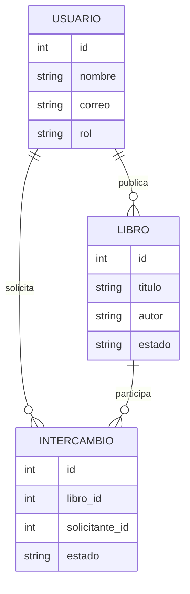
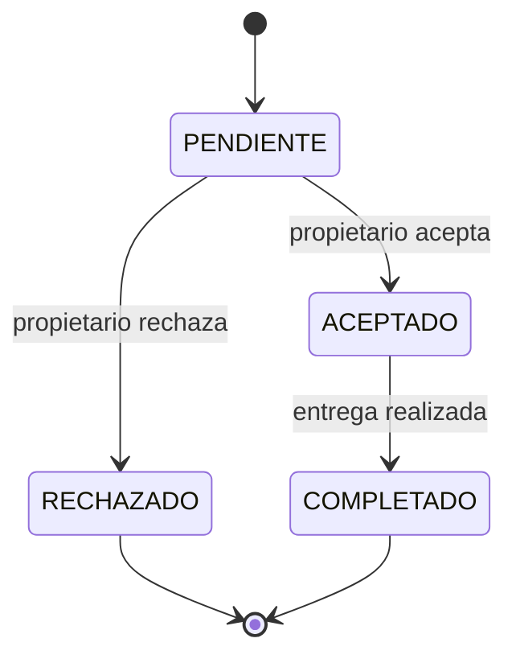

# Hito 1 — Ficha del negocio

**Proyecto:** Plataforma de Intercambio de Libros Usados  
**Integrantes:** Kenyis Yusley Tumbaco Pillasagua y ____________________  
**Paralelo:** ____________________

---

## 1. Negocio de referencia

El negocio tomado como referencia es **Clankart**, una plataforma creada por Nitesh Garg en India y orientada principalmente a estudiantes. Su objetivo es permitir que los estudiantes publiquen y vendan libros usados directamente a otros estudiantes.

La plataforma surgió al identificar que muchos estudiantes utilizaban sus libros solamente durante uno o dos semestres y luego dejaban de utilizarlos. Clankart permite publicar estos libros para que otros estudiantes puedan encontrarlos y adquirirlos.

De acuerdo con el caso publicado por Starter Story, Clankart funciona como un marketplace para estudiantes y la publicación de libros se ofrece de manera gratuita. En el caso presentado se reportan más de 25.000 estudiantes registrados y aproximadamente USD 1.200 de ingresos mensuales.

Este caso sirve como referencia porque nuestro proyecto también busca aprovechar libros usados y facilitar que estudiantes puedan encontrarlos mediante una plataforma digital.

**Fuente:** Starter Story — caso de Clankart.  
https://www.starterstory.com/stories/clankart

---

## 2. Caso de contraste

Como caso de contraste se considera **BIGWORDS**, una empresa relacionada con el mercado de libros de texto para estudiantes. La empresa comenzó en 1998 y llegó a crecer considerablemente, incluyendo inversión externa y una estructura empresarial grande. Sin embargo, durante la crisis de las empresas puntocom terminó en bancarrota.

Posteriormente, el proyecto fue retomado con un modelo diferente, enfocado principalmente en comparar precios de libros y conectar a los estudiantes con diferentes vendedores, evitando mantener directamente inventario y procesos de envío.

Nuestra hipótesis es que una plataforma de libros debe evitar una estructura demasiado costosa durante sus primeras etapas. Por esta razón, nuestro proyecto plantea una solución sencilla donde la plataforma organiza la información de los libros y permite gestionar su disponibilidad sin asumir inicialmente procesos complejos como almacenamiento o logística propia.

**Fuente:** TechCrunch — “Kayak For Textbooks: How BIGWORDS Raised $80M, Went Bankrupt, Then Got Profitable Again”.  
https://techcrunch.com/2012/08/16/the-bigwords-story/

---

## 3. Adaptación al Ecuador

Para adaptar la idea al contexto ecuatoriano se consideran las siguientes condiciones:

| Condición local | Efecto en el proyecto | Adaptación realizada |
|---|---|---|
| Costos de movilización y envío | Enviar un libro puede aumentar el costo para el estudiante. | Se priorizan intercambios o entregas acordadas directamente entre usuarios. |
| Confianza entre usuarios | Una persona puede publicar información incorrecta o no cumplir con la entrega. | Los libros utilizan estados definidos para identificar su situación dentro de la plataforma. |
| Uso de grupos y redes sociales para vender artículos usados | La información puede quedar desorganizada y ser difícil de consultar. | La plataforma almacena los libros en una base de datos y permite consultarlos mediante una API. |

### Cambio realizado al modelo

La adaptación principal consiste en utilizar un campo `Estado` para los libros.

Este campo permite conocer si un libro se encuentra disponible o en otra condición definida por el sistema. De esta forma se evita depender únicamente de mensajes informales entre estudiantes y se mantiene información organizada dentro de la plataforma.

La primera versión no incluye pagos electrónicos ni logística propia. Su objetivo es demostrar el registro, consulta y administración de los libros mediante el servidor.

---

## 4. Modelo de datos

El dominio completo de la Plataforma de Intercambio de Libros Usados contempla usuarios, libros y los procesos asociados al intercambio. En la versión actual del servidor, la entidad implementada y comprobada mediante la API es `Libro`.

### Entidad Usuario

| Campo | Tipo | Descripción |
|---|---|---|
| id | entero | Identificador del usuario. |
| nombre | texto | Nombre del usuario. |
| correo | texto | Correo del usuario. |
| rol | uno de una lista cerrada | Rol asignado dentro de la plataforma. |

### Entidad Libro

| Campo | Tipo | Descripción |
|---|---|---|
| id | entero | Identificador del libro. |
| titulo | texto | Título del libro. |
| autor | texto | Autor del libro. |
| estado | uno de una lista cerrada | Situación actual del libro. |

### Entidad Intercambio

| Campo | Tipo | Descripción |
|---|---|---|
| id | entero | Identificador del intercambio. |
| libro_id | referencia | Libro relacionado con la solicitud. |
| solicitante_id | referencia | Usuario que realiza la solicitud. |
| estado | uno de una lista cerrada | Estado actual del intercambio. |
| creado | fecha y hora | Momento en que se crea la solicitud. |

### Relaciones

| Entidad A | Relación | Entidad B |
|---|---|---|
| Usuario | 1:N | Libro |
| Usuario | 1:N | Intercambio |
| Libro | 1:N | Intercambio |

### Estructuras Go propuestas para el dominio

```go
type Usuario struct {
	ID     uint   `gorm:"primaryKey" json:"id"`
	Nombre string `gorm:"not null" json:"nombre"`
	Correo string `gorm:"unique;not null" json:"correo"`
	Rol    string `gorm:"not null" json:"rol"`
}

type Libro struct {
	ID     uint   `gorm:"primaryKey" json:"id"`
	Titulo string `gorm:"not null" json:"titulo"`
	Autor  string `gorm:"not null" json:"autor"`
	Estado string `gorm:"not null" json:"estado"`
}

type Intercambio struct {
	ID            uint   `gorm:"primaryKey" json:"id"`
	LibroID       uint   `gorm:"not null" json:"libro_id"`
	SolicitanteID uint   `gorm:"not null" json:"solicitante_id"`
	Estado        string `gorm:"not null" json:"estado"`
}
```

### Diagrama del modelo



### Decisión debatible

Se decidió representar el estado como un campo controlado dentro de las entidades en lugar de permitir cualquier texto libre.

Esto facilita las validaciones del servidor y evita guardar estados incorrectos. En las pruebas automáticas del proyecto se comprueba que un estado inválido produce una respuesta HTTP `422`.

---

## 5. Máquina de estados

Para el proceso completo de intercambio se plantea la siguiente máquina de estados.

### Estados

| Estado | Descripción |
|---|---|
| PENDIENTE | Estado inicial de una solicitud. |
| ACEPTADO | La solicitud fue aceptada. |
| RECHAZADO | La solicitud fue rechazada. |
| COMPLETADO | El intercambio fue realizado. |

El estado inicial es:

**PENDIENTE**

### Transiciones permitidas

| Estado actual | Nuevo estado | Quién realiza la acción | Condición |
|---|---|---|---|
| PENDIENTE | ACEPTADO | Propietario | La solicitud es válida y el libro está disponible. |
| PENDIENTE | RECHAZADO | Propietario | El propietario decide no realizar el intercambio. |
| ACEPTADO | COMPLETADO | Usuario/Propietario | La entrega del libro fue realizada. |

### Diagrama de estados



### Transición prohibida

No se permite:

```text
RECHAZADO → ACEPTADO
```

La razón es que una solicitud rechazada se considera finalizada. Si los usuarios desean intentar nuevamente el intercambio, deberán crear una nueva solicitud.

---

## 6. Roles y permisos

Se plantean dos roles principales: `Usuario` y `Administrador`.

| Acción | Usuario | Administrador |
|---|---|---|
| Consultar libros | Sí | Sí |
| Registrar libro | Sí | Sí |
| Consultar un libro | Sí | Sí |
| Modificar sus libros | Sí | Sí |
| Eliminar sus libros | Sí | Sí |
| Gestionar libros de otros usuarios | No | Sí |
| Supervisar información del sistema | No | Sí |

El usuario trabaja principalmente con sus propios libros, mientras que el administrador tiene permisos de gestión y supervisión sobre la información registrada.

---

## 7. Mapa de endpoints por rol

La API implementada actualmente utiliza `Libro` como entidad principal del CRUD.

### Endpoints

| Método | Ruta | Rol | Pantalla | Retorna | Validación | Error |
|---|---|---|---|---|---|---|
| GET | `/libros` | Usuario/Admin | Lista de libros | Lista de libros | Parámetros recibidos | 400/500 |
| GET | `/libros/{id}` | Usuario/Admin | Detalle del libro | Libro solicitado | ID válido y existencia | 400/404 |
| POST | `/libros` | Usuario/Admin | Publicar libro | Libro creado | Título, autor y estado | 400/422 |
| PUT | `/libros/{id}` | Usuario/Admin | Editar libro | Libro actualizado | ID, campos y estado | 400/404/422 |
| DELETE | `/libros/{id}` | Usuario/Admin | Gestión de libro | Confirmación | ID y existencia | 400/404 |

### Matriz pantalla × endpoint

| Pantalla | Endpoint utilizado |
|---|---|
| Lista de libros | `GET /libros` |
| Detalle del libro | `GET /libros/{id}` |
| Publicar libro | `POST /libros` |
| Editar libro | `PUT /libros/{id}` |
| Eliminar libro | `DELETE /libros/{id}` |

### Endpoints comprobados

Durante las pruebas manuales se verificó el funcionamiento de:

```text
GET    /libros
GET    /libros/1
POST   /libros
PUT    /libros/4
DELETE /libros/4
```

También se comprobó una creación correcta mediante:

```text
POST /libros
```

obteniendo:

```text
201 Created
```

y se comprobó una validación enviando un título vacío, obteniendo el mensaje:

```text
Titulo y autor son obligatorios
```

Las rutas se encuentran configuradas desde `main.go` y los manejadores correspondientes se encuentran dentro de:

```text
internal/libros/
```

---

## 8. Declaración de IA

Se utilizó ChatGPT como herramienta de apoyo durante el desarrollo del Hito 1.

La inteligencia artificial fue utilizada para apoyar la organización de la documentación, revisar la estructura de la ficha y del addendum, explicar comandos de Go, PostgreSQL y PowerShell, y apoyar la revisión de las pruebas y endpoints.

El equipo ejecutó y comprobó directamente el servidor, la conexión con PostgreSQL, las operaciones CRUD y las pruebas automáticas.

Las decisiones finales relacionadas con el modelo del negocio, el código, las entidades, las validaciones y la documentación fueron revisadas por los integrantes del equipo.